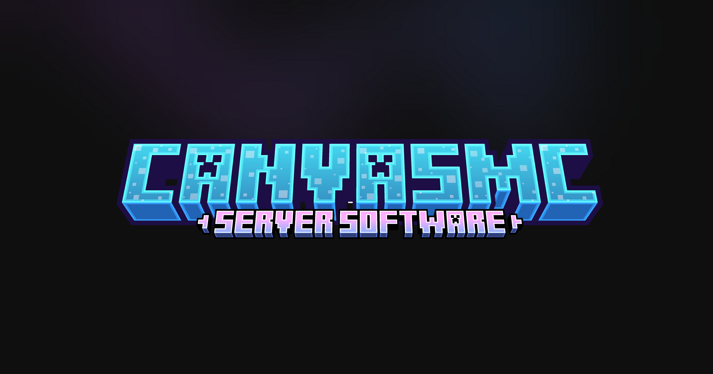

# Petiole

基于 [CraftCanvasMC/Canvas](https://github.com/CraftCanvasMC/Canvas)（Folia 下游）的独立维护 fork · Minecraft 26.2

[](LICENSE)
[](https://github.com/CraftCanvasMC/Canvas)

本 fork 在上游 Canvas 之上维护一组生电向原版机制还原与插件兼容补丁，独立发布与跟踪。

| | 特性 | 文档 |
|---|---|---|
| 🧱 | 命令方块重新启用（配置门控） | [FORK.md §1](FORK.md) |
| ⚙️ | Vanilla-like 原版机制还原（28 项） | [FORK.md §2 §4](FORK.md) |
| 🕰️ | Old Feature 旧版机制（6 项） | [FORK.md §3](FORK.md) |
| 🫧 | 原版末影珍珠（替换 Canvas 内置持久化） | [FORK.md §5](FORK.md) |
| 💾 | Linear 区域格式（B_LINEAR/LINEAR_V2，省 ~50% 磁盘） | [FORK.md §6](FORK.md) |
| 🔌 | 插件 API 兼容层（Lecithin，18 项恢复） | [FORK.md §7](FORK.md) |

> 补丁来源与许可证为硬性合并条件，逐补丁台账见 [PROVENANCE.md](PROVENANCE.md)。

---

## 血统与上游

Petiole ← Canvas ← Folia ← Paper。继续跟踪合并上游 [CraftCanvasMC/Canvas](https://github.com/CraftCanvasMC/Canvas)；
Canvas 自身从 Paper upstream，因此可以不等 Folia 先行更新 Minecraft 版本。

## 获取与构建

### 下载

从 [Releases](https://github.com/wosnxn123/Petiole/releases) 获取最新 paperclip JAR，Java 25+ 运行。

### 从源码构建

**要求：** Java 25、Git

```bash
./gradlew applyAllPatches        # 应用全部补丁构建 Petiole 源码
./gradlew createPaperclipJar     # 构建 paperclip jar
./gradlew runDevServer           # 本地启动开发服务器
```

## 兼容性说明

* Petiole 是 **Folia 系** fork，不是 Purpur/Paper 等非区域化线程分支的直接替代。
* 严格遵守 Folia 线程安全规则，不允许插件绕过（未标记 `folia-supported`/`canvas-supported` 的插件按 Folia 规则阻止）。
* 插件生态兼容：保留 `canvas-supported` 插件描述标志与 Canvas 插件 API 兼容层。

## 许可与致谢

Petiole 的许可证继承自上游项目链：[GPL-3.0](https://github.com/CraftCanvasMC/Canvas/blob/main/LICENSE)，
以及 CanvasMC 团队与各补丁来源作者（Lithium、Leaf、Luminol 等）的补丁许可。
完整许可文本见仓库 `petiole-server/src/main/resources/META-INF/licenses/` 目录；
逐补丁来源台账见 [PROVENANCE.md](PROVENANCE.md)。

上游资源（配置文档等仍适用）：

* Canvas 文档：[docs.canvasmc.io](https://docs.canvasmc.io)
* Canvas 仓库：[github.com/CraftCanvasMC/Canvas](https://github.com/CraftCanvasMC/Canvas)
